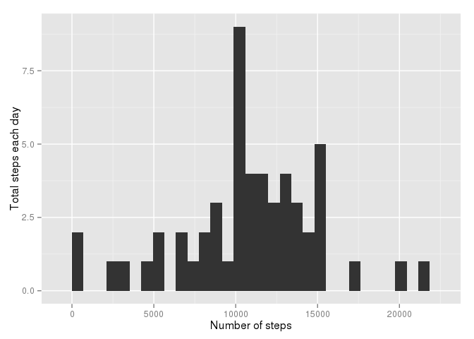
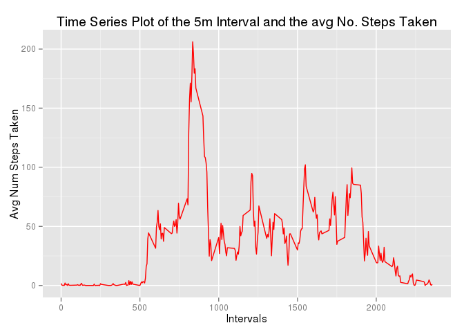
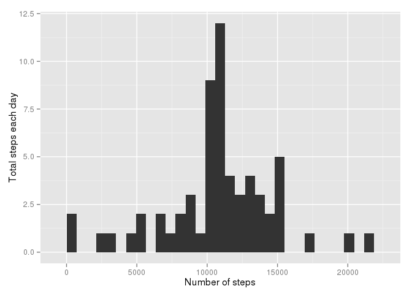
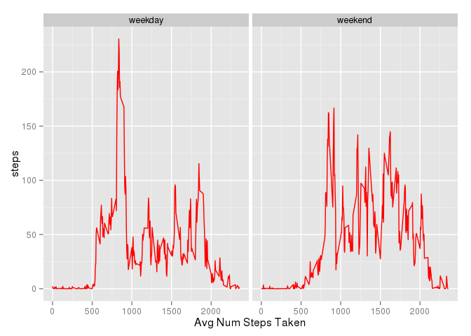

# Reproducible Research: Peer Assessment 1


## Loading and preprocessing the data

Load provided the data.


```r
unzip("activity.zip")

activity <- read.csv(file = './activity.csv',  
  sep=",",
  header=TRUE,
  na.strings="NA",
  colClasses=c("numeric", "character", "numeric"),
  stringsAsFactors = FALSE)
```

Process/transform the data


```r
activity$date <- as.Date(activity$date)
```

## What is mean total number of steps taken per day?

Calculate the total number of steps taken per day


```r
dailyActivity <-
  aggregate(formula = steps~date, data = activity,
            FUN = sum, na.rm=TRUE)
```


histogram of the total number of steps taken each day


```r
library(ggplot2)
histogram <- qplot(x=steps, data=dailyActivity) +
  labs(y='Total steps each day', x='Number of steps')
plot(histogram)
```

 

Calculate and report the mean and median of the total number of steps taken per day


```r
meanSteps <- round(mean(dailyActivity$steps), 2)  # Mean
medianSteps <- quantile(x = dailyActivity$steps, probs = 0.5)  # Median
```

## What is the average daily activity pattern?

Make a time series plot (i.e. type = "l") of the 5-minute interval (x-axis) and the average number of steps taken, averaged across all days (y-axis)


```r
intervalActivity <- aggregate(formula = steps~interval, data = activity, FUN = mean, na.rm=TRUE)
```

Plot the average number of steps per interval.


```r
myPlot <- ggplot(
        intervalActivity,
        aes(intervalActivity$interval, intervalActivity$steps),)
myPlot + 
    geom_line(colour="red") + 
    ggtitle("Time Series Plot of the 5m Interval and the avg No. Steps Taken") +
    xlab("Intervals") +
    ylab("Avg Num Steps Taken")
```

 


Which 5-minute interval, on average across all the days in the dataset, contains the maximum number of steps?


```r
maxSteps <- intervalActivity[intervalActivity$steps==max(intervalActivity$steps),]
```


## Imputing missing values

Total number of missing values in the dataset (i.e. the total number of rows with NAs)


```r
totalNAs <- sum(is.na(activity))
totalNAs
```

```
## [1] 2304
```

Devise a strategy for filling in all of the missing values in the dataset.

The averaged steps per interval (over all days) will be used to replace the missing value for a given day/interval.

Create a new dataset that is equal to the original dataset but with the missing data filled in.


```r
# replace missing values with the averaged steps per interval
activityCompleted <- activity
for(r in 1:nrow(activityCompleted)){
  if (is.na(activityCompleted$steps[r])) {
    repl <- intervalActivity$steps[intervalActivity$interval == activityCompleted$interval[r]];
    activityCompleted$steps[r] <- repl;
  }
}
# we verify it worked
sum(is.na(activityCompleted$steps))
```

```
## [1] 0
```

Make a histogram of the total number of steps taken each day and Calculate and report the mean and median total number of steps taken per day.


```r
dailyActivityCompleted <-
  aggregate(formula = steps~date, data = activityCompleted,
            FUN = sum, na.rm=TRUE)
```

Histogram of the total number of steps taken each day


```r
library(ggplot2)
histogram <- qplot(x=steps, data=dailyActivityCompleted) +
  labs(y='Total steps each day', x='Number of steps')
plot(histogram)
```

 


```r
mean(dailyActivityCompleted$steps, na.rm=TRUE)
```

```
## [1] 10766.19
```


```r
median(dailyActivityCompleted$steps, na.rm=TRUE)
```

```
## [1] 10766.19
```


Do these values differ from the estimates from the first part of the assignment? 

The added missing values doesn't change the shape of the histogram. The median and the mean are unchanged.

What is the impact of imputing missing data on the estimates of the total daily number of steps?

The total daily number of steps increases as a result of added value.


## Are there differences in activity patterns between weekdays and weekends?

Create a new factor variable in the dataset with two levels – “weekday” and “weekend” indicating whether a given date is a weekday or weekend day.


```r
activityCompleted$day <- "weekday"
activityCompleted$day[weekdays(as.Date(activityCompleted$date)) %in% c("samedi","dimanche")] <- "weekend"
```

```r
table(activityCompleted$day)
```

```
## 
## weekday weekend 
##   12960    4608
```

Make a panel plot containing a time series plot (i.e. type = "l") of the 5-minute interval (x-axis) and the average number of steps taken, averaged across all weekday days or weekend days (y-axis). 


myPlot <- ggplot(
        intervalActivity,
        aes(intervalActivity$interval, intervalActivity$steps),)
myPlot + 
    geom_line(colour="red") + 
    ggtitle("Time Series Plot of the 5m Interval and the avg No. Steps Taken") +
    xlab("Intervals") +
    ylab("Avg Num Steps Taken")


```r
library(scales)

ggplot(activityCompleted, aes(date, steps)) +
    geom_line(color="blue") +
    xlab("Daily 5 minute Intervals") +
    ylab("Average Number of Steps")
```

 

```r
    facet_grid(. ~ day)
```

```
## facet_grid( ~ day)
```
